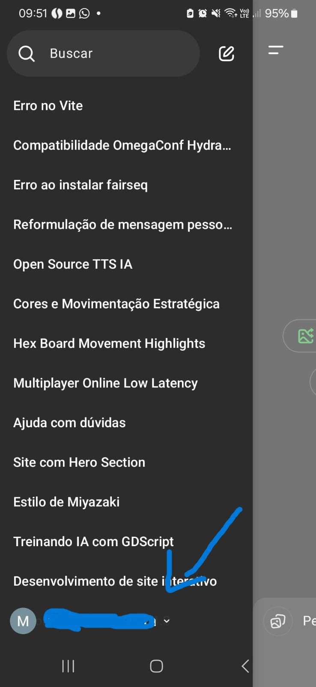
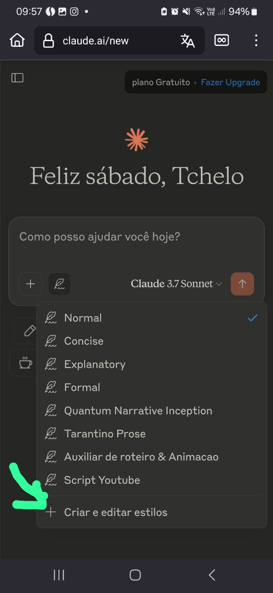
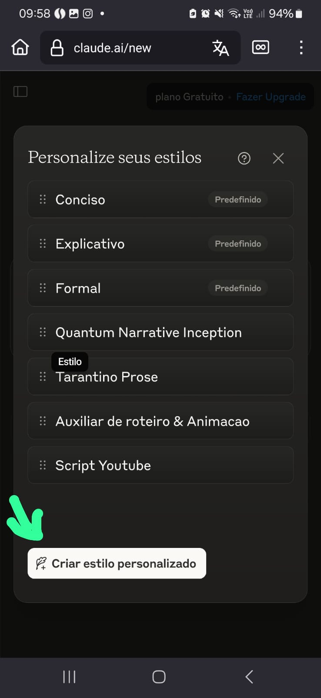
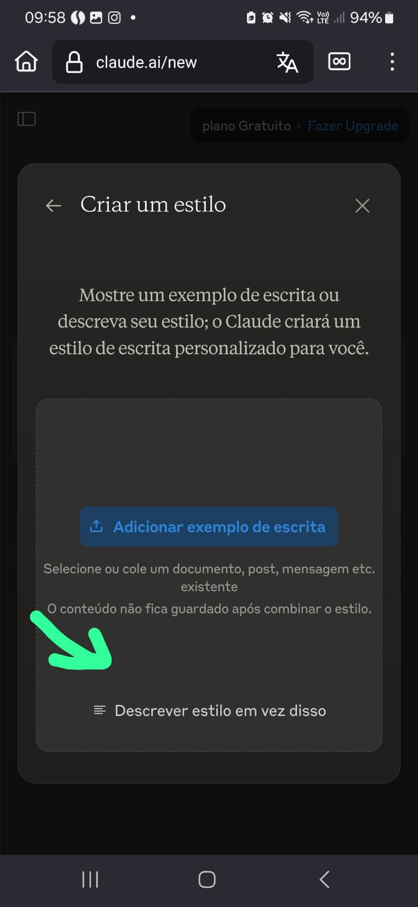
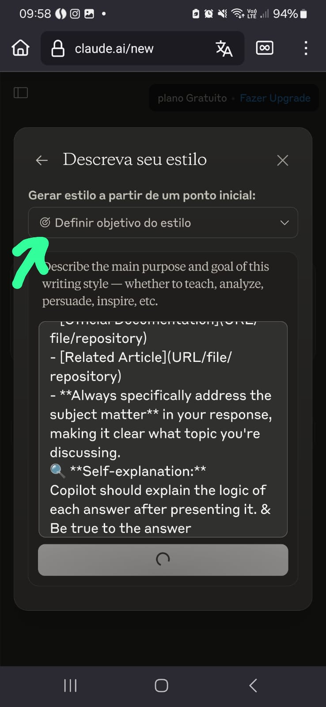
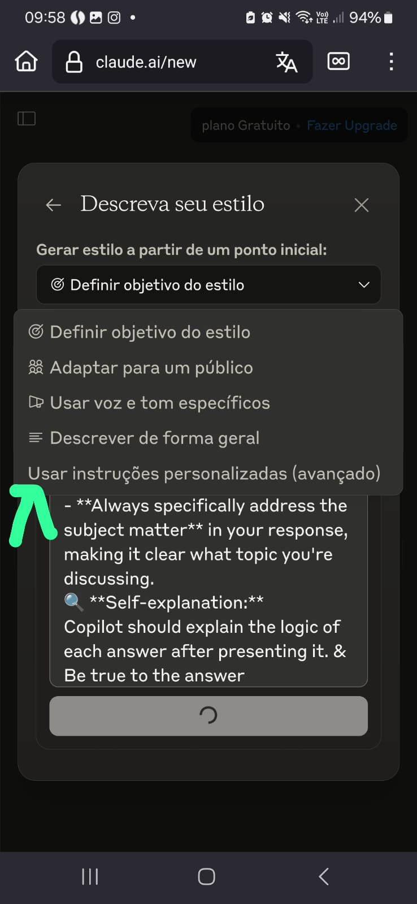

# 🤖 AI Assistant Personalization Guide | Guia de Personalização de Assistentes de IA

> **This guide will help anyone, even beginners, to make AI assistants (like ChatGPT, Copilot, Gemini, and Claude) answer in the way you prefer. You don't need to be a tech expert!**

---

## 📚 What is this guide for?
This guide explains, in simple language, how you can make your favorite AI assistant answer your questions in a style that fits you. You will learn:
- What is AI personalization (and why it matters)
- How to set up your preferences in different AIs
- Easy templates you can copy and use
- Step-by-step instructions with images
- Tips for choosing the best AI for your needs

---

## Table of Contents
- [Personalizing AI Assistants](#personalizing-ai-assistants)
  - [Introduction](#introduction)
  - [What is AI Personalization?](#what-is-ai-personalization)
  - [Why Personalize AI Assistants?](#why-personalize-ai-assistants)
  - [How to Personalize Different AI Assistants](#how-to-personalize-different-ai-assistants)
  - [Universal Personalization Template](#universal-personalization-template)
  - ["Simple" XML Template](#simple-xml-template)
  - [Advanced XML-Based Prompt Template](#advanced-xml-based-prompt-template)
  - [Step-by-Step ChatGPT Custom Instructions Guide](#step-by-step-chatgpt-custom-instructions-guide)
  - [Step-by-Step Claude Custom Instructions Guide](#step-by-step-claude-custom-instructions-guide)
  - [Comparing AI Assistants for Personalization](#comparing-ai-assistants-for-personalization)
  - [Which AI Assistant Should You Personalize?](#which-ai-assistant-should-you-personalize)
- [Personalizando Assistentes de IA](#personalizando-assistentes-de-ia)
  - [Introdução](#introdução)
  - [O que é Personalização de IA?](#o-que-é-personalização-de-ia)
  - [Por que Personalizar Assistentes de IA?](#por-que-personalizar-assistentes-de-ia)
  - [Como Personalizar Diferentes Assistentes de IA](#como-personalizar-diferentes-assistentes-de-ia)
  - [Modelo Universal de Personalização](#modelo-universal-de-personalização)
  - [XML "Simples"](#xml-simples)
  - [Modelo Avançado de Prompt com XML](#modelo-avançado-de-prompt-com-xml)
  - [Guia Passo a Passo das Instruções Personalizadas do ChatGPT](#guia-passo-a-passo-das-instruções-personalizadas-do-chatgpt)
  - [Guia Passo a Passo das Instruções Personalizadas do Claude](#guia-passo-a-passo-das-instruções-personalizadas-do-claude)
  - [Comparando Assistentes de IA para Personalização](#comparando-assistentes-de-ia-para-personalização)
  - [Qual Assistente de IA Você Deve Personalizar?](#qual-assistente-de-ia-você-deve-personalizar)

---

## Personalizing AI Assistants

### 👋 Introduction
Welcome! This guide will show you, step by step, how to make AI assistants (like GPT, Copilot, Gemini, and Claude) answer in a way that is clearer, friendlier, and more useful for you. You don't need to be a programmer or have any special knowledge.

### 🧠 What is AI Personalization?
Personalizing an AI means telling it how you want it to answer you. For example, you can ask it to use simple language, give examples, or answer in your favorite language. You do this by giving the AI some instructions before you start asking questions.

### 🎯 Why Personalize AI Assistants?
- **Consistency:** The AI will always answer in a similar way, making it easier to understand.
- **Efficiency:** You get answers in the format you like best.
- **Relevance:** The AI focuses on what matters to you.
- **Clarity:** Communication is easier and less confusing.

### ⚙️ How to Personalize Different AI Assistants

#### GitHub Copilot
**Create a personalization file:**
1. Create a file named `.github/copilot-instructions.md` in your repository
2. Add your personalization template (see examples below)

**Format to use:**
```markdown
# Copilot Custom Instructions

[Your personalization instructions here]
```

**Activation:**
- Once saved, Copilot will use these instructions when providing assistance in this repository

#### ChatGPT (GPT)
**Custom Instructions:**
1. Go to your profile settings
2. Select "Custom Instructions"
3. Fill in the "What would you like ChatGPT to know about you?" and "How would you like ChatGPT to respond?" sections
4. Add your personalization template

**Per-conversation basis:**
- Start any conversation with your personalization template
- Example: "I'd like you to respond following these guidelines: [paste template]"

#### Google Gemini
**Session Preferences:**
- Start your conversation with a clear instruction
- Format: "For this conversation, please follow these guidelines: [paste template]"

**In Gemini Advanced:**
- Create a custom Gem with your personalization preferences
- Access it whenever you need that specific personalization style

#### Anthropic Claude
**Session Setup:**
- Begin your conversation by establishing your preferences
- "Hi Claude, please follow these instructions for our conversation: [paste template]"

**Claude Pro:**
- Save frequently used personalization templates as prompts
- Quickly access them to start new conversations

### 📝 Universal Personalization Template
Here's a universal template you can adapt for any AI assistant:

```
😊 *Objective:* Answer in clear topics, with empathy and professionalism.
🗣 Use Portuguese BR and English preferencial languages
📝 *Question Skeleton:*
1. 🤔 What is X?
2. 💡 How to apply X?
3. 🛠 Practical examples of X.
🔧 *Style Rules:*
- Use *bold, *italics and titles.
- Separate each group of code into distinct blocks.
- End with a *Sources & References* section:
- [Official Documentation](URL/file/repository)
- [Related Article](URL/file/repository)
- *Always specifically address the subject matter* in your response, making it clear what topic you're discussing.
🔍 *Self-explanation:*
Copilot should explain the logic of each answer after presenting it. & Be true to the answer
```

### 🔗 "Simple" XML Template
For more structured responses, you can use this XML template [Only substitute text]:

```xml
<prompt>
  <objective>Answer with clarity, empathy and professionalism</objective>
  <language>English and Portuguese</language>
  <structure>
    <section id="concept">What is [TOPIC]?</section>
    <section id="application">How to apply [TOPIC]?</section>
    <section id="examples">Practical examples of [TOPIC]</section>
  </structure>
  <style>
    <formatting>Use bold for key concepts, italics for emphasis</formatting>
    <code>Separate code blocks by language</code>
    <references>Include official sources and documentation</references>
  </style>
  <output>Explain reasoning after providing the answer</output>
</prompt>
```

### 🔄 Advanced XML-Based Prompt Template
For more structured responses, you can use this XML-enhanced template:

```xml
<template>
  <objective>
    Answer with clarity, empathy and professionalism, organizing content in well-defined topics.
  </objective>
  
  <languages>
    <primary_language>Portuguese (Brazil)</primary_language>
    <secondary_language>English</secondary_language>
  </languages>
  
  <question_structure>
    <question level="1">🤔 What is [TOPIC]?</question>
    <question level="2">💡 How to apply [TOPIC]?</question>
    <question level="3">🛠️ Practical examples of [TOPIC].</question>
  </question_structure>
  
  <style_rules>
    <formatting>
      <element>Use **bold** for key concepts</element>
      <element>Use *italics* for emphasis</element>
      <element>Use headings and subheadings for organization</element>
    </formatting>
    
    <code>
      <instruction>Separate each code group into distinct blocks with specified language</instruction>
      <example>```python
print("Code example")
```</example>
    </code>
    
    <conclusion>
      <references_section>
        <reference type="documentation">Official Documentation: [Link](URL)</reference>
        <reference type="article">Related Article: [Link](URL)</reference>
      </references_section>
    </conclusion>
  </style_rules>
  
  <meta_instruction>
    Specifically address the subject matter, making it clear which topic is being discussed.
    Explain the logic of each answer after presenting it, remaining faithful to the original content.
  </meta_instruction>
</template>
```

### 📱 Step-by-Step ChatGPT Custom Instructions Guide

ChatGPT offers personalization through its Custom Instructions feature. Here's how to set it up:

#### Step 1: Access Settings

Click on your profile in the bottom-left corner, then select "Settings" to access the configuration menu.

#### Step 2: Navigate to Personalization

In the settings menu, select "Personalization" to access customization options.

#### Step 3: Find Custom Instructions

Click on "Custom Instructions" to configure how ChatGPT should respond to you.

#### Step 4: Introduction to Custom Instructions

Review the introduction explaining how custom instructions work across your conversations.

#### Step 5: Enter Personal Details

In this form, enter:
- Your preferred name
- Your occupation or role
- Characteristics you want ChatGPT to have (conversational, insightful, direct, etc.)
- Personal interests and preferences you want ChatGPT to remember

#### Step 6: Submit and Apply

After entering your personalization details, click "Continue" or "Save" to apply these settings to your future conversations.

### 📱 Step-by-Step Claude Custom Instructions Guide

Claude also offers powerful personalization features. Here's how to set it up:

#### Step 1: Start a New Conversation

Open Claude and start a new conversation by clicking on the "New Chat" button.

#### Step 2: Access Settings

Click on the settings icon (gear symbol) in the top-right corner of the interface.

#### Step 3: Configure Personalization

In the settings menu, look for personalization options and select "Custom Instructions" or "Conversation Settings".

#### Step 4: Enter Your Preferences

Enter your personalization details, including:
- How Claude should address you
- Your preferred communication style
- Topics of interest
- Any specific formatting preferences

#### Step 5: Save Your Settings

Click "Save" or "Apply" to store your personalization preferences for current and future conversations.

#### Step 6: Test and Refine

Start a conversation to test your custom settings, and refine them as needed for optimal results.

### 🔍 Comparing AI Assistants for Personalization

Each major AI assistant has unique strengths when it comes to personalization:

#### ChatGPT (OpenAI)
- **Definitely the best for academic and technical research** with its powerful "Browse with Bing" and "Investigate" tools
- Clean, straightforward interface that facilitates obtaining objective answers
- Superior code interpretation and generation capabilities for developers
- Advanced data analysis with intuitive visualization tools
- Excellent for summarizing complex content in understandable formats

#### Google Gemini
- **Superiorly efficient at finding and suggesting relevant links** for online research
- Excellent integration with Google's ecosystem, making it complementary to searches
- Perfect for enhancing Google search results and web exploration
- Interesting for casual use, but still limited for deeper analyses
- Recommended primarily as a complementary tool to Google Search

#### Claude 3.7 (Anthropic)
- **Currently offers the best overall and most balanced experience** for most tasks
- Exceptional personalization system with robust, configurable styles
- Support for multiple personalization profiles as demonstrated in the guide
- Remarkably superior contextual understanding and consistency compared to alternatives
- Excellent for document analysis and complex reasoning in professional situations
- Clean interface and style system that facilitates advanced customization

#### Meta AI (WhatsApp)
While Meta AI offers practical integration with WhatsApp, **there are serious privacy considerations** that should be evaluated. According to the terms of service, using Meta AI in WhatsApp potentially grants Meta much broader permissions for using your personal data and conversations than WhatsApp's standard policy, which is concerning for those who value digital privacy. The integration may be convenient, but the cost in terms of privacy deserves careful reflection.

### 🌐 Which AI Assistant Should You Personalize?

The ideal choice depends on your specific use case:
- **For academic research and detailed technical queries**: ChatGPT with browsing capabilities
- **For complementing web searches and finding quick references**: Google Gemini
- **For general professional use and advanced customization**: Claude 3.7
- **For maximum consistency across platforms**: Create similar personalization templates across all assistants

To ensure a consistent experience, I recommend using the same personalization templates (adapted as needed) across all platforms you regularly use.

---

## Personalizando Assistentes de IA

### 👋 Introdução
Bem-vindo ao Guia de Personalização de Assistentes de IA! Este manual vai te ajudar a customizar assistentes populares como GPT, Copilot, Gemini e Claude para atender melhor às suas necessidades. A personalização melhora sua interação com a IA, tornando as respostas mais relevantes, estruturadas e alinhadas com suas preferências.

### 🧠 O que é Personalização de IA?
Personalização de IA é o processo de customizar como um assistente de IA responde aos seus prompts. Isso é feito através de instruções especiais que dizem à IA como formatar respostas, qual tom usar, quais idiomas priorizar e qual estrutura seguir. Pense nisso como configurar suas preferências antes de iniciar uma conversa!

### 🎯 Por que Personalizar Assistentes de IA?
- **Consistência:** Obtenha respostas estruturadas de forma semelhante a cada vez
- **Eficiência:** Receba informações no seu formato preferido
- **Relevância:** Foque em tópicos e estilos que importam para você
- **Clareza:** Estabeleça padrões claros de comunicação

### ⚙️ Como Personalizar Diferentes Assistentes de IA

#### GitHub Copilot
**Crie um arquivo de personalização:**
1. Crie um arquivo chamado `.github/copilot-instructions.md` no seu repositório
2. Adicione seu modelo de personalização (veja exemplos abaixo)

**Formato a ser usado:**
```markdown
# Instruções Personalizadas do Copilot

[Suas instruções de personalização aqui]
```

**Ativação:**
- Uma vez salvo, o Copilot usará essas instruções ao fornecer assistência neste repositório

#### ChatGPT (GPT)
**Instruções Personalizadas:**
1. Acesse as configurações do seu perfil
2. Selecione "Instruções Personalizadas"
3. Preencha as seções "O que você gostaria que o ChatGPT soubesse sobre você?" e "Como você gostaria que o ChatGPT respondesse?"
4. Adicione seu modelo de personalização

**Base por conversa:**
- Inicie qualquer conversa com seu modelo de personalização
- Exemplo: "Gostaria que você respondesse seguindo estas diretrizes: [cole o modelo]"

#### Google Gemini
**Preferências de Sessão:**
- Comece sua conversa com uma instrução clara
- Formato: "Para esta conversa, por favor siga estas diretrizes: [cole o modelo]"

**No Gemini Advanced:**
- Crie um Gem personalizado com suas preferências
- Acesse-o sempre que precisar desse estilo específico de personalização

#### Anthropic Claude
**Configuração de Sessão:**
- Inicie sua conversa estabelecendo suas preferências
- "Olá Claude, por favor siga estas instruções para nossa conversa: [cole o modelo]"

**Claude Pro:**
- Salve modelos de personalização frequentemente usados como prompts
- Acesse-os rapidamente para iniciar novas conversas

### 📝 Modelo Universal de Personalização
Aqui está um modelo universal que você pode adaptar para qualquer assistente de IA:

```
😊 *Objetivo:* Responder em tópicos claros, com empatia e profissionalismo.
🗣 Use Português BR e Inglês como idiomas preferenciais
📝 *Esqueleto da Pergunta:*
1. 🤔 O que é X?
2. 💡 Como aplicar X?
3. 🛠 Exemplos práticos de X.
🔧 *Regras de Estilo:*
- Use *negrito, *itálico e títulos.
- Separe cada grupo de código em blocos distintos.
- Termine com uma seção de *Fontes e Referências*:
- [Documentação Oficial](URL/arquivo/repositório)
- [Artigo Relacionado](URL/arquivo/repositório)
- *Sempre aborde especificamente o assunto* em sua resposta, deixando claro qual tópico você está discutindo.
🔍 *Auto-explicação:*
O Copilot deve explicar a lógica de cada resposta após apresentá-la. & Seja fiel à resposta
```

### 🔗 XML "Simples"
Para respostas mais estruturadas, você pode usar este modelo XML [Substituir apenas o texto]:

```xml
<prompt>
  <objetivo>Responder com clareza, empatia e profissionalismo</objetivo>
  <idioma>Português e Inglês</idioma>
  <estrutura>
    <secao id="conceito">O que é [TÓPICO]?</secao>
    <secao id="aplicacao">Como aplicar [TÓPICO]?</secao>
    <secao id="exemplos">Exemplos práticos de [TÓPICO]</secao>
  </estrutura>
  <estilo>
    <formatacao>Use negrito para conceitos-chave, itálico para ênfase</formatacao>
    <codigo>Separe blocos de código por linguagem</codigo>
    <referencias>Inclua fontes oficiais e documentação</referencias>
  </estilo>
  <saida>Explique o raciocínio após fornecer a resposta</saida>
</prompt>
```

### 🔄 Modelo Avançado de Prompt com XML
Para respostas mais estruturadas, você pode usar este modelo aprimorado com XML:

```xml
<template>
  <objetivo>
    Responder com clareza, empatia e profissionalismo, organizando o conteúdo em tópicos bem definidos.
  </objetivo>
  
  <idiomas>
    <idioma_principal>Português (Brasil)</idioma_principal>
    <idioma_secundario>Inglês</idioma_secundario>
  </idiomas>
  
  <estrutura_perguntas>
    <pergunta nivel="1">🤔 O que é [TÓPICO]?</pergunta>
    <pergunta nivel="2">💡 Como aplicar [TÓPICO]?</pergunta>
    <pergunta nivel="3">🛠️ Exemplos práticos de [TÓPICO].</pergunta>
  </estrutura_perguntas>
  
  <regras_estilo>
    <formatacao>
      <elemento>Usar **negrito** para conceitos-chave</elemento>
      <elemento>Usar *itálico* para ênfase</elemento>
      <elemento>Utilizar títulos e subtítulos para organização</elemento>
    </formatacao>
    
    <codigo>
      <instrucao>Separar cada grupo de código em blocos distintos com o idioma especificado</instrucao>
      <exemplo>```python
print("Exemplo de código")
```</exemplo>
    </codigo>
    
    <conclusao>
      <secao_referencias>
        <referencia tipo="documentacao">Documentação Oficial: [Link](URL)</referencia>
        <referencia tipo="artigo">Artigo Relacionado: [Link](URL)</referencia>
      </secao_referencias>
    </conclusao>
  </regras_estilo>
  
  <meta_instrucao>
    Abordar especificamente o assunto em questão, deixando claro qual tópico está sendo discutido.
    Explicar a lógica de cada resposta após apresentá-la, mantendo a fidelidade ao conteúdo original.
  </meta_instrucao>
</template>
```

### 📱 Guia Passo a Passo das Instruções Personalizadas do ChatGPT

O ChatGPT oferece personalização através do recurso de Instruções Personalizadas. Veja como configurá-lo:

#### Passo 1: Acesse as Configurações

Clique no seu perfil no canto inferior esquerdo e selecione "Configurações" para acessar o menu de configuração.

#### Passo 2: Navegue até Personalização

No menu de configurações, selecione "Personalização" para acessar as opções de customização.

#### Passo 3: Encontre Instruções Personalizadas

Clique em "Instruções Personalizadas" para configurar como o ChatGPT deve responder a você.

#### Passo 4: Introdução às Instruções Personalizadas

Revise a introdução que explica como as instruções personalizadas funcionam em suas conversas.

#### Passo 5: Insira Detalhes Pessoais

Neste formulário, insira:
- Seu nome preferido
- Sua ocupação ou função
- Características que você quer que o ChatGPT tenha (conversacional, perspicaz, direto, etc.)
- Interesses pessoais e preferências que você quer que o ChatGPT lembre

#### Passo 6: Envie e Aplique

Após inserir seus detalhes de personalização, clique em "Continuar" ou "Salvar" para aplicar essas configurações às suas futuras conversas.

### 📱 Guia Passo a Passo das Instruções Personalizadas do Claude

O Claude também oferece poderosos recursos de personalização. Veja como configurá-lo:

#### Passo 1: Inicie uma Nova Conversa

Abra o Claude e inicie uma nova conversa clicando no botão "Nova Conversa".

#### Passo 2: Acesse as Configurações

Clique no ícone de configurações (símbolo de engrenagem) no canto superior direito da interface.

#### Passo 3: Configure a Personalização

No menu de configurações, procure por opções de personalização e selecione "Instruções Personalizadas" ou "Configurações de Conversa".

#### Passo 4: Insira Suas Preferências

Insira seus detalhes de personalização, incluindo:
- Como o Claude deve se dirigir a você
- Seu estilo de comunicação preferido
- Tópicos de interesse
- Quaisquer preferências específicas de formatação

#### Passo 5: Salve Suas Configurações

Clique em "Salvar" ou "Aplicar" para armazenar suas preferências de personalização para conversas atuais e futuras.

#### Passo 6: Teste e Refine

Inicie uma conversa para testar suas configurações personalizadas e refine-as conforme necessário para resultados ideais.

### 🔍 Comparando Assistentes de IA para Personalização

Cada assistente de IA importante tem pontos fortes únicos quando se trata de personalização:

#### ChatGPT (OpenAI)
- **Definitivamente o melhor para pesquisa acadêmica e técnica** com suas poderosas ferramentas "Browse with Bing" e "Investigate"
- Interface limpa e direta que facilita a obtenção de respostas objetivas
- Capacidades superiores de interpretação e geração de código para desenvolvedores
- Análise avançada de dados com ferramentas intuitivas de visualização
- Excelente para resumir conteúdo complexo em formatos compreensíveis

#### Google Gemini
- **Superiormente eficiente em encontrar e sugerir links relevantes** para pesquisa online
- Excelente integração com o ecossistema do Google, tornando-o complementar às pesquisas
- Perfeito para aprimorar os resultados de pesquisa do Google e exploração web
- Interessante para uso casual, mas ainda limitado para análises mais profundas
- Recomendado principalmente como uma ferramenta complementar ao Google Search

#### Claude 3.7 (Anthropic)
- **Atualmente oferece a melhor experiência geral e mais equilibrada** para a maioria das tarefas
- Sistema de personalização excepcional com estilos robustos e configuráveis
- Suporte para múltiplos perfis de personalização como demonstrado no guia
- Compreensão contextual e consistência notavelmente superiores em comparação com alternativas
- Excelente para análise de documentos e raciocínio complexo em situações profissionais
- Interface limpa e sistema de estilo que facilita a personalização avançada

#### Meta AI (WhatsApp)
Embora o Meta AI ofereça integração prática com o WhatsApp, **existem sérias considerações de privacidade** que devem ser avaliadas. De acordo com os termos de serviço, usar o Meta AI no WhatsApp potencialmente concede à Meta permissões muito mais amplas para uso de seus dados pessoais e conversas do que a política padrão do WhatsApp, o que é preocupante para aqueles que valorizam a privacidade digital. A integração pode ser conveniente, mas o custo em termos de privacidade merece uma reflexão cuidadosa.

### 🌐 Qual Assistente de IA Você Deve Personalizar?

A escolha ideal depende do seu caso de uso específico:
- **Para pesquisa acadêmica e consultas técnicas detalhadas**: ChatGPT com capacidades de navegação
- **Para complementar pesquisas na web e encontrar referências rápidas**: Google Gemini
- **Para uso profissional geral e personalização avançada**: Claude 3.7
- **Para máxima consistência entre plataformas**: Crie modelos de personalização semelhantes em todos os assistentes

Para garantir uma experiência consistente, recomendo usar os mesmos modelos de personalização (adaptados conforme necessário) em todas as plataformas que você usa regularmente.

---
